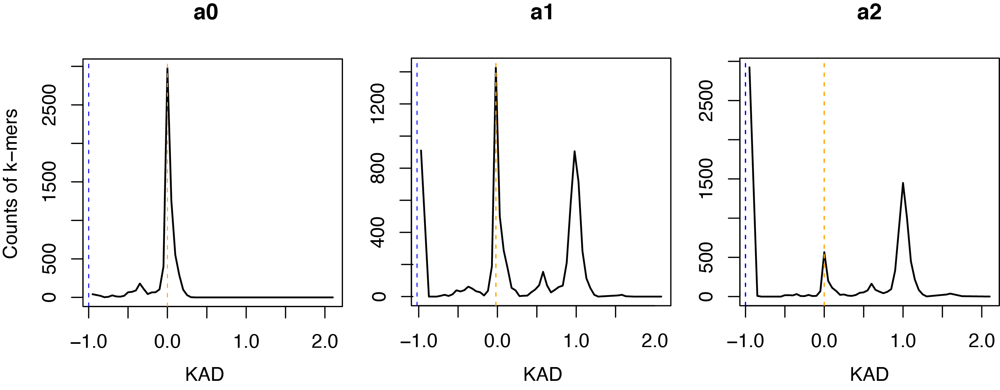
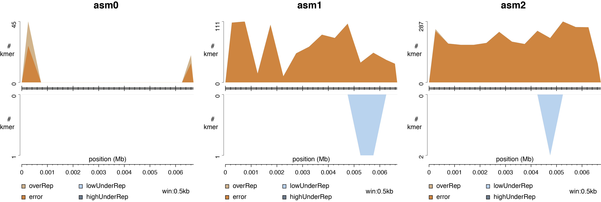
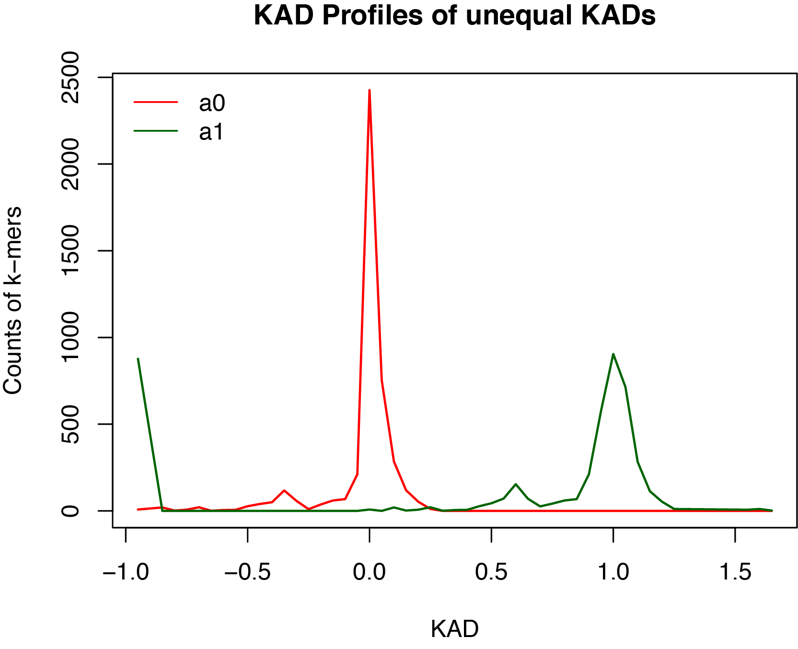

# KAD
Assessing genome assemblies by comparing k-mer copies in assemblies and k-mer abundance in reads

See a case run at [case_Ecoli](case_Ecoli)

### Introduction
KAD is designed for evaluating the accuracy of nucleotide base quality of genome assemblies. Briefly, abundance of k-mers are quantified for both sequencing reads and assembly sequences. Comparison of the two values results in a single value per k-mer, K-mer Abundance Difference (KAD), which indicates how well the assembly matches read data for each k-mer.


where, _c_ is the count of a k-mer from reads, _m_ is the mode of counts of read k-mers, and _n_ is the copy of the k-mer in the assembly. 

### Requirements
The script was written with Perl and R is invoked. Both Perl and R are generally installed. If needed, please refer to [Perl](https://www.perl.org/) and [R](https://www.r-project.org/) for installation guides. To generate reports, [pandoc](https://pandoc.org) and R packages [knitr](https://github.com/yihui/knitr) and [rmarkdown](https://rmarkdown.rstudio.com) are needed to be installed.

[Jellyfish](https://www.cbcb.umd.edu/software/jellyfish/) is used to generate k-mers by using either FASTA or FASTQ data. The binary Jellyfish executable is included in the [bin](https://github.com/liu3zhenlab/KAD/edit/master/bin/) directory of the KAD package.

To run KADdist.pl, [bowtie](http://bowtie-bio.sourceforge.net/index.shtml) and [bedtools](https://bedtools.readthedocs.io/en/latest/) are required.

### Intallation of all requirements via Conda
Aternatively, all required packages can be installed through [conda](https://docs.conda.io/en/latest/)
```
conda create -n kad
conda activate kad
conda install -c anaconda perl
conda install -c r r-base r-knitr r-rmarkdown
conda install -c bioconda pandoc bowtie bedtools
```
### Installation of KAD
Basically, the installation is just to copy all KAD files in a directory. KAD can be directly used afterwards.
```
git clone https://github.com/liu3zhenlab/KAD.git  
perl ./KAD/KADprofile.pl
```

### Data requirements
**1. Read data**  
Illumina sequencing reads with 40x or higher sequence depth. Trimmed clean reads or error corrected reads are preferred. Raw data without trimming are not recommended.

**2. Assembly data**  
Assembly sequencing data in FASTA format. Each assembly is in a single FASTA file.

### Scripts and options
1. [KADprofile.pl](KADprofile.pl): producing KAD profiles for input assemblies.  
**Usage**: perl KADprofile.pl [options]  
**[Options]**  
    --**read** \<file\>:	\*FASTQ/A file of reads (required)  
                        the parameter can be used multiple times; zip files with the suffix of .gz are allowed. required.  
    --**asm** \<file\>:	\*FASTA file of the assembly (required)  
                        the parameter can be used multiple times to allow using multiple FASTA file;  
                        each file is considered an indepedent assembly.  
    --**threads** \<num\>:number of cpus (1)  
    --**minc** \<num\>:	minimal number of counts per k-mer from reads (5)  
                        k-mers with counts smaller than \<num\> are not output.  
    --**rid** \<str\>:	ID used in the header of the k-mer table generated from reads.  
    --**aid** \<str\>:	ID used in the header of the k-mer table generated from an assembly;  
                        the parameter can be used multiple times to match --asm inputs.  
                        By default, a header ID is generated from the file name of each assembly  
                        by removing PATH and the suffix of .fa, .fas, or .fasta.  
			IMPORTANT: If multiple --aid parameters are specified, their order must match corresponding --asm order.  
    --**prefix** \<str\>: the output directory and the prefix for output files (kad).  
    --**klen** \<num\>:   length of k-mers (25).  
    --**kadcutoff** <str of nums>: a set of numbers to define k-mer categories; default="-1 -0.5, 0.5, 0.75, 2".  
This parameter is used to categorize k-mers into:  
1.*OverRep*: over-represented k-mers (KAD<-1; higher abundance in the assembly than indicated by reads);  
2.*Good*: correct k-mer (-0.5 <= KAD <= 0.5; relatively equal abundance);  
3.*LowUnderRep*: a low-level of under-represented k-mers (0.75 <= KAD < 2; lower abundance in the assembly);  
4.*HighUnderRep*: a high-level of under-represented k-mers (KAD >= 2; lower abundance in the assembly).  
**Note**: error k-mers (*Error*) are k-mers with KADs equaling -1, which is unrelated to this parameter.  
    --**readdepth** <num>: estimated depth of reads; not required; if specified, it will be used to evaluate the accuracy of "cmode".  
    --**binlen** <num>: length of KAD interval for KAD statistics; similar to bin size for determining KAD histogram (0.05)  
    --**version**:	version information  
    --**help**:		help information

2. [KADdist.pl](KADdist.pl): generating distributions of error and other k-mers on contigs or chromosomes.  
**Usage** KADdist.pl [options]  
**[Options]**  
    --**kad**|k <file>:      KAD output file from KADprofile.pl (required).  
    --**aid**|i <str>:       assembly ID in the header of KAD file (required).  
    --**asm**|a <file>:      assembly FASTA file, including path (required).  
    --**mincopy**|m <num>:   k-mers  with at least --mincopy in the assembly will be aligned to the assembly (1).  
    --**maxcopy**|i <num>:   k-mers  with at most --maxcopy in the assembly will be aligned to the assembly (100).  
    --**winsize**|w <num>:   window size on which the number of each KAD type is counted (50000).  
    --**kadcutoff**|s <str>: same to --kadcutoff in the KADprofile.pl ("-1 -0.5 0.5 0.75 2").  
	This parameter is used to categorize k-mers into:  
	1.*OverRep*: over-represented k-mers (KAD <= -1; higher abundance in the assembly than indicated by reads);  
	2.*Good*: correct k-mer (-0.5 <= KAD <= 0.5; relatively equal abundance);  
	3. *LowUnderRep*: a low-level of under-represented k-mers (0.75 <= KAD < 2; lower abundance in the assembly);  
	4. *HighUnderRep*: a high-level of under-represented k-mers (KAD >= 2; lower abundance in the assembly).  
	**Note**: error k-mers (*Error*) are k-mers with KADs equaling -1, which is unrelated to this parameter.  
    --**prefix**|p <str>:    the output directory and the prefix for output files (KADdist).  
    --**minwin4plot**|n <num>: contigs or chromosomes with minimum window number (--minwin4plot) will be plotted (10).  
    --**pdfoutdir**|o <str>: the subdirectory under --prefix directory for PDF outputs (pdf).  
    --**help**:              help information.  
	
3. [KADcompare.pl](KADcompare.pl): comparing k-mers with unequal KADs between two assemblies.  
**Usage**: perl KADcompare.pl [options] \<kad\>  
*note: \<kad\> is the output generated by KADprofile.pl, which containing KAD values of k-mers.*  
**[Options]**  
    --**set1**:	\*assembly ID 1 in the \<kad\> file (required).  
    --**set2**:	\*assembly ID 2 in the \<kad\> file (required).  
    --**prefix**:	the output directory and the prefix for output filess (KC).  
    --**binlen**:	bin length to count KAD (0.05).  
    --**force**:	overwrite the existing directory if specified; if not, quit if the output directory exists.  
    --**help**: 	help information

### Examples:
**Analysis 1. KAD profiling**  
This analysis will generate KAD profiles for each input assembly. You will see numbers of total k-mers, good k-mers, error k-mers, and k-mers of other groups of each assembly.

_**how to run**_  
Let us say you have three assembly versions, as shown in the *data* directory:
1. asm0.fas
2. asm1.fas
3. asm2.fas

You also have a read set:
1. read1.fq.gz
2. read2.fq.gz

*Data note*: These are 2x150bp paired-end reads with 0.2% errors simulated from asm0.fas. The simulated assembly data asm1 and asm2 contain ~1% and ~5% differences from asm0, respectively.

Assuming the Perl script was in the directory of _scriptpath_, run the following script to generate KAD profiles for all three assemblies.
```
perl <scriptpath>/KADprofile.pl --read read1.fq.gz --read read2.fq.gz \
                              --asm asm0.fas --asm asm1.fas --asm asm2.fas
```

You might want to assign names of all three assemblies with new names different from file names, such as a0, a1, and a2.
```
perl <scriptpath>/KADprofile.pl --read read1.fq --read read2.fq \
                              --asm asm0.fas --asm asm1.fas --asm asm2.fas \
                              --aid a0 --aid a1 --aid a2
```
The number and order of _--aid_ inputs MUST match with _--asm_ inputs.

The parameter _--minc_ might need to change to avoid the interference from a great number of low counts (e.g. 1-3) from error sequences. By default, it is set to 5. However, if high-depth data (e.g., >100x) are generated, the number needs to be increased. Approximately 1/10 of the estimated depth might be a reasonable cutoff.

If corrected reads are used, _--minc_ can be set to a small number (e.g., 3).

```
perl <scriptpath>/KADprofile.pl --read read1.fq.gz --read read2.fq.gz \
                              --asm asm0.fas --asm asm1.fas --asm asm2.fas \
                              --aid a0 --aid a1 --aid a2 \
			      --prefix 1-KADprofile
```
A html report in the _report_ subdirectory is generated from each run. Check the [report](examples/KAD_Profiling_Report.pdf).

A *KAD profile plot* was generated for each assembly. Here are three KAD profile plots:



**Analysis 2. k-mer distribution on contigs or chromosomes of an assembly**  
Based on KAD values of k-mers from Analysis 1, problematic k-mers can be categorized into "error", "overRep", "lowUnderRep", and "highUnderRep", representing k-mers with errors, over-represention, low levels of under-representation, and high levels of under-representation in the assembly. The script [KADdist.pl](KADdist.pl) maps these k-mers to the assembly and combines the KAD value each k-mer to produce:  
1. a wiggle track format ([wig](https://genome.ucsc.edu/goldenPath/help/wiggle.html)) file  
2. a [bigwig](https://genome.ucsc.edu/goldenpath/help/bigWig.html) file for visualization  
3. mapping location of error k-mers  
4. plots of distributions of problematic k-mers  

_**how to run**_  
For example, from Analysis 1, the assembly *a0* (asm0.fas) was KAD profiled. With the ouput file suffixed with "kad.txt" from Analysis 1, distributions of problematic k-mers can be further analyzed. Below is the example script:

```
perl <scriptpath>/KADdist.pl \ 
--kad 1-KADprofile/1-KADprofile_4_kad.txt \
--prefix a0_dist \
--aid a0 --asm asm0.fas \
--winsize 500  # 500 minimum window size; added becaused this example has a small contig
```



**Analysis 3. KAD comparison between two assemblies**  
This analysis will directly compare two assemblies based on KADs of the subset of k-mers that have unequal KADs.

After running the analysis using [KADprofile.pl](KADprofile.pl), KAD values are generated. In the [examples](https://github.com/liu3zhenlab/KAD/tree/master/examples) directory, the file **result_4_kad.txt** contains KAD values. We now can select any two assemblies in this file to compare.

_**how to run**_  
Assuming again the Perl script was in the directory of _scriptpath_, the following run compares a0 with a1. Note that the input _--set1_ and _--set2_ should match the assembly names used in the KAD file.

```
perl scriptpath/KADcompare.pl --set1 a0 --set2 a1 --prefix a0_a1 1-KADprofile/1-KADprofile_4_kad.txt
```

Here shows the comparison plot for the comparison between a1 and a0.



**Notes**: Here are what analysis 3 does:  
*First*, the script extracts k-mers with unequal copies in the two assemblies. Two KADs per k-mer of the two assemblies are therefore different. Of two KADs per k-mer, one KAD may be NA because zero count of the k-mer from both reads and the assembly. These NAs are converted to 0 due to the agreement between reads and assembly data.

*Second*, the script counts KAD per defined bin, which, by default, is 0.05. Separate counts per bin of two assemblies are used for visualizing the two KAD profiles of k-mers with unequal KADs.

The result from three analyses indicates that ends of the sequence (a0) were not well sampled in reads. And most "LowUnderRef" k-mers of a1 and a2 assemblies are true k-mers found in reads but not identified in each assembly, which are replaced by actually error k-mers in the assemblies.
